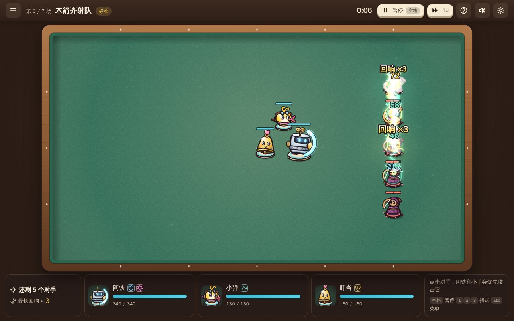
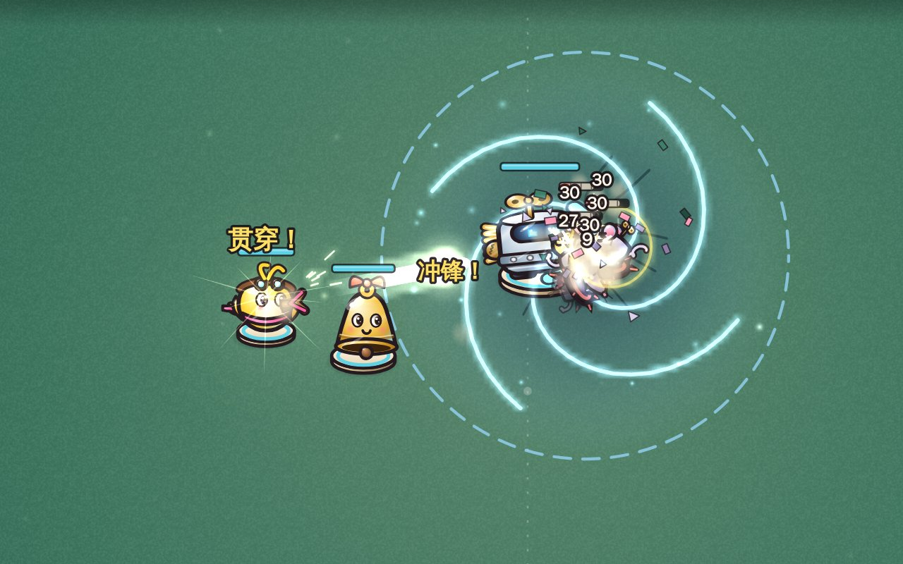
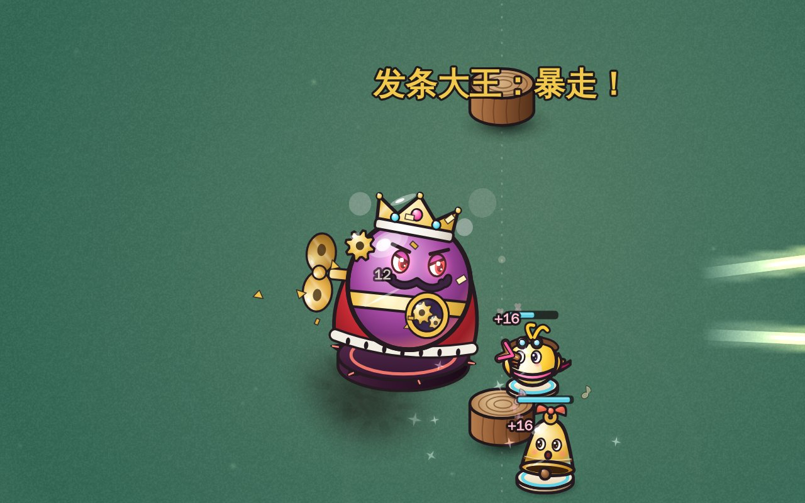
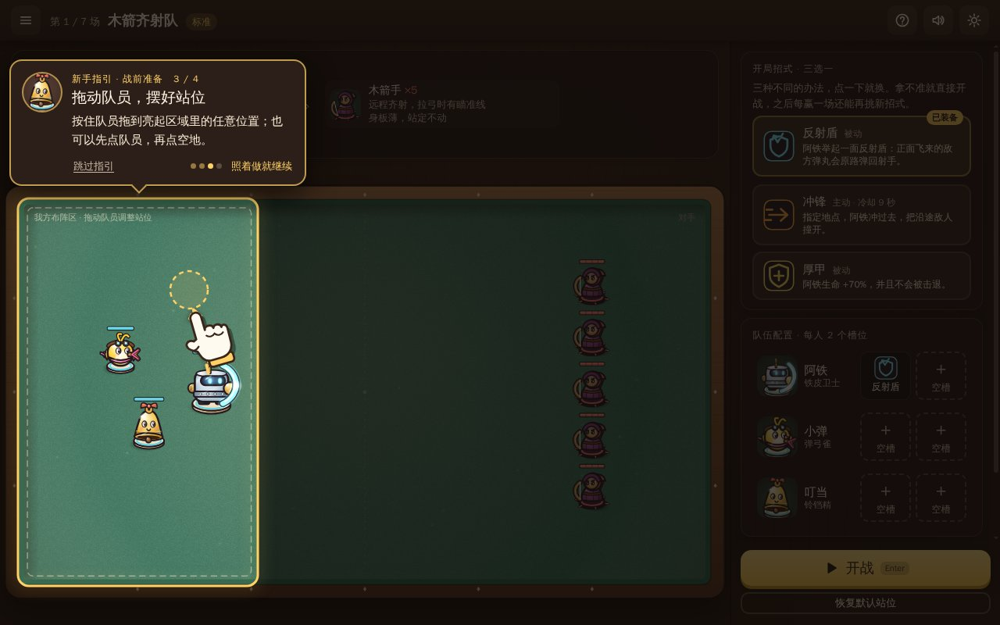
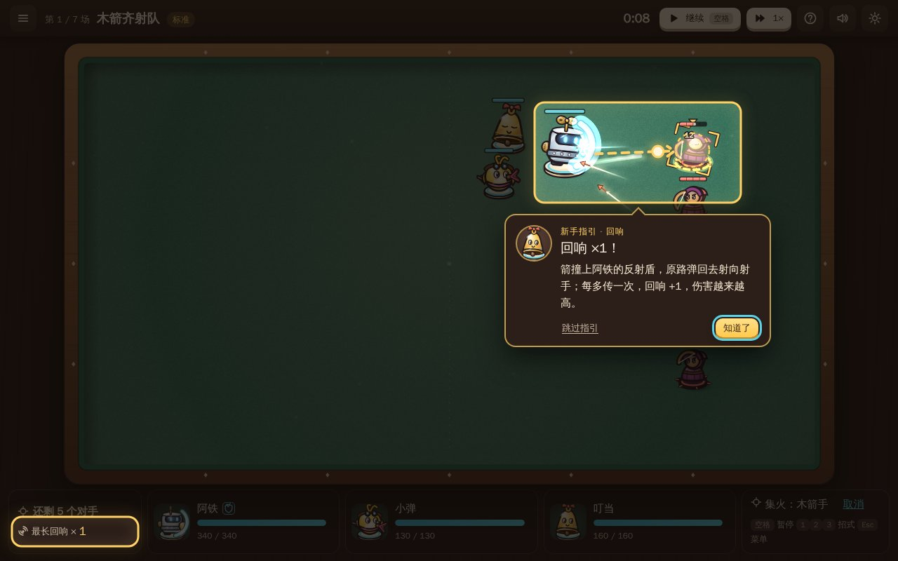
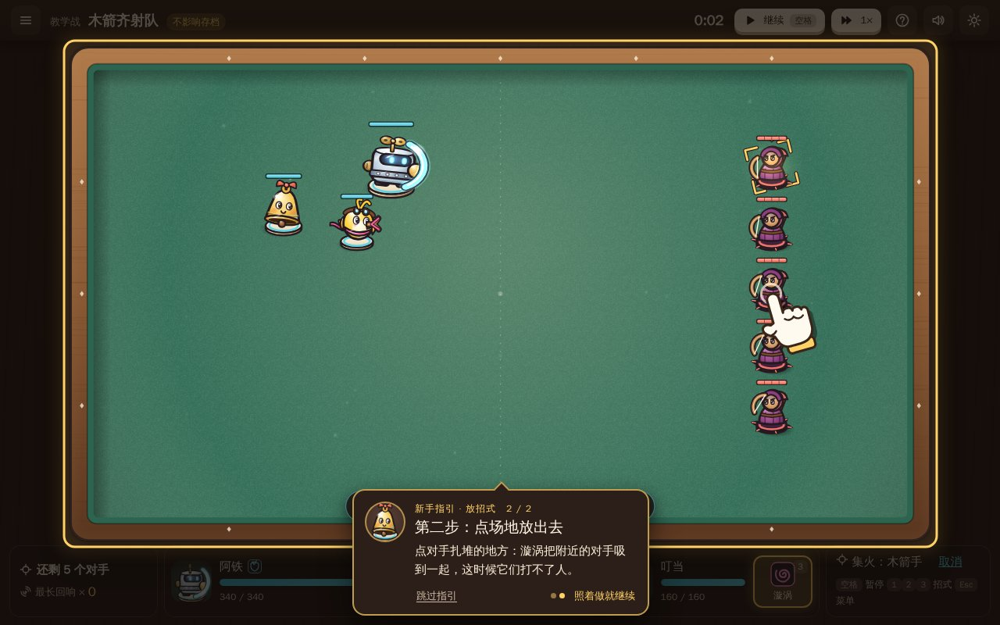
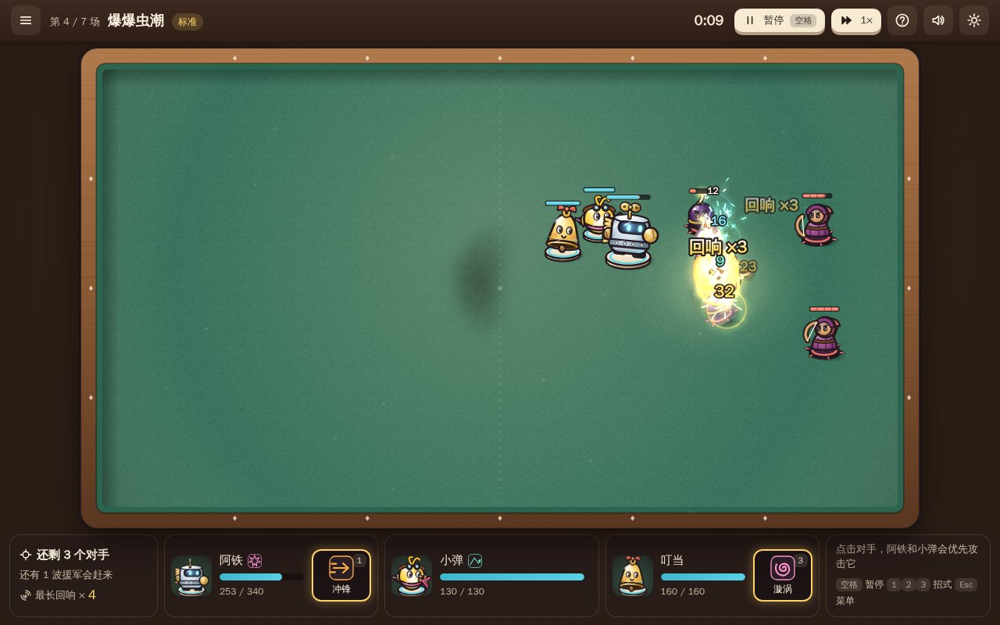
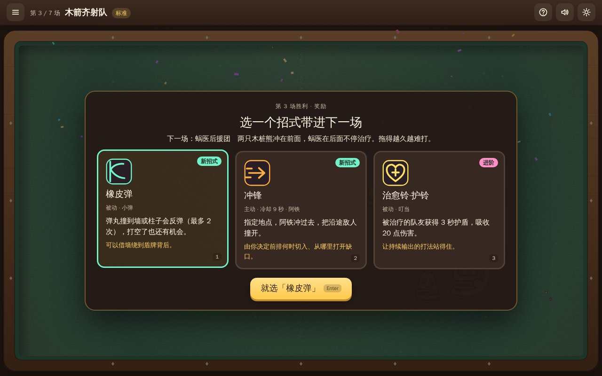
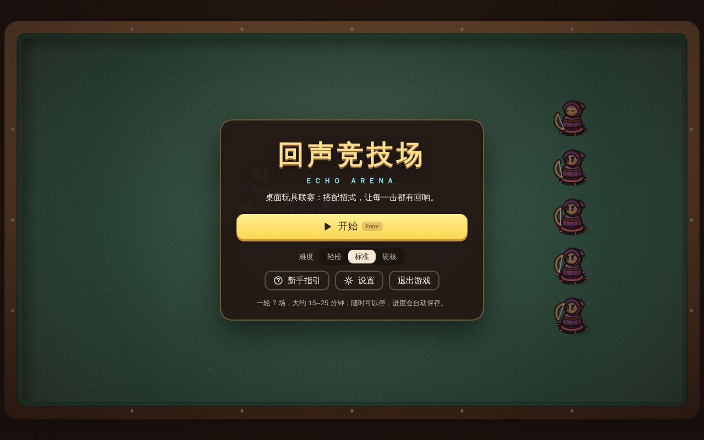

# 回声竞技场

深夜书桌上的玩具联赛。你的三名玩具队员（铁皮卫士阿铁、弹弓雀小弹、铃铛精叮当）会自己走位、自己攻击；你负责挑招式、装配、摆站位，战斗中抓时机放主动招式、点敌人集火。

弹丸被盾牌弹回、弹向下一个敌人、撞墙反弹、敌人被击飞撞上同伴、倒下时连环爆炸……每传递一次，**回响**就 +1，伤害更高，颜色和音高也跟着往上走。一轮 7 场，最后一场对手是发条大王。

| 漩涡把发条鼠卷到一起，阿铁冲锋撞进去，贯穿射从中间穿过 | 发条大王血量掉到三分之一：暴走，眼睛发红、头顶冒蒸汽   |
| ------------------------------------------------------ | ------------------------------------------------------ |
|      |              |
| **新手指引：手指演示，照着拖一下摆站位**               | **新手指引：第一次打出回响时定格，画出箭弹回去的路线** |
|    |        |
| **教学战：放招式第二步，点对手扎堆的地方**             | **爆爆虫潮：冲锋、弹射、连爆一路连锁**                 |
|     |                 |
| **赢了三选一：新招式或进阶**                           | **标题画面**                                           |
|                  |                 |

## 开始玩

### 下载安装包（推荐）

到仓库的 [Releases](https://github.com/XZL-CODE/echo-arena/releases) 下载（每次推送代码后，[Actions](https://github.com/XZL-CODE/echo-arena/actions) 里的“构建与打包”也会产出同样的安装包，登录 GitHub 后可下载）：

| 系统                             | 文件                                 | 说明                                           |
| -------------------------------- | ------------------------------------ | ---------------------------------------------- |
| macOS（Apple 芯片与 Intel 通用） | `EchoArena-<版本>-mac-universal.dmg` | 打开后把 EchoArena（回声竞技场）拖进“应用程序” |
| Windows 10/11（64 位）           | `EchoArena-<版本>-win-setup.exe`     | 安装版，可选安装位置，建桌面快捷方式           |
| Windows 10/11（64 位）           | `EchoArena-<版本>-win-portable.exe`  | 免安装，双击即玩                               |

安装包没有做苹果公证和微软签名，第一次打开会被系统拦一下：

- **macOS**：提示无法验证开发者时，打开“系统设置 → 隐私与安全性”，在页面下方点“仍要打开”。如果提示“已损坏”，在终端执行 `xattr -dr com.apple.quarantine /Applications/EchoArena.app` 后再打开。
- **Windows**：出现“Windows 已保护你的电脑”时，点“更多信息 → 仍要运行”。

### 从源码运行

需要 [Node.js](https://nodejs.org) 22.12 或更新版本。

- macOS：双击 `启动游戏-macOS.command`（若被系统拦截，处理方式同上；若提示没有权限，先执行 `chmod +x 启动游戏-macOS.command`）。
- Windows：双击 `启动游戏-Windows.cmd`。
- 或者在项目目录执行 `npm start`。

第一次运行会自动安装依赖、下载 Electron（约 100 MB，需要联网；官方源下载失败时自动改用 npmmirror 镜像）并构建，之后可以离线游玩。

## 操作

所有操作都能用触控板点击完成，键盘快捷键是补充：

| 操作               | 方式                                                                                     |
| ------------------ | ---------------------------------------------------------------------------------------- |
| 开战 / 确认 / 继续 | 按钮，或 `Enter`                                                                         |
| 暂停 / 继续        | 顶栏“暂停”，或 `空格`；暂停时也能放招式、点选集火                                        |
| 主动招式           | 点底栏技能按钮，或按 `1` `2` `3`（阿铁 / 小弹 / 叮当），再点场地选位置；`Esc` 或右键取消 |
| 集火               | 战斗中点一个敌人（再点一次取消）                                                         |
| 战斗速度           | 顶栏按钮，或 `F`（1× / 2×）                                                              |
| 奖励三选一         | 点卡片，或按 `1` `2` `3`                                                                 |
| 输了原样再来       | 按钮，或 `R`                                                                             |
| 菜单 / 静音        | `Esc` / `M`                                                                              |
| 新手指引           | 顶栏的“？”重看当前界面（战斗中打开会自动暂停）；标题页的“新手指引”进教学战从头练         |

战前准备：点槽位或招式查看说明并装上、卸下；在场上拖动队员调整开场位置（也可以先点队员，再点空地）。

**新手指引**：新安装后在真实界面上边玩边教。每一步压暗其余界面、只亮出要操作的地方，手指动画演示点哪里、往哪拖，照着做了才进入下一步（讲战斗时战斗停着等你）。各课在对应情形第一次出现时教：

- 第一次战前准备：看对手 → 选开局招式 → 拖动队员摆站位 → 点“开战”。
- 第一次开战：点一个对手集火 → 按空格开打。
- 第一次能放主动招式：第一步点招式按钮（或按数字键），第二步点场地放出去。
- 第一次打出回响：定格在那一刻，画出弹丸接下来飞向谁。
- 第一场结算、第一次挑奖励：点哪里去挑奖励，三选一后怎么带进下一场；输了讲原样再来和调整再试。

“跳过指引”或 `Esc` 一次跳过全部课程，之后不再自动出现。想再看：游戏里点顶栏的“？”重看当前界面的操作（每一步都能直接点“下一步”翻）；标题页的“新手指引”进一场教学战，从头到尾练一遍，不影响存档里的这一轮。老版本更新上来的存档不会自动教。

## 玩法

- **一轮 7 场**：第 1 场固定是远程齐射的木箭齐射队，中间 5 场从对手池里抽，第 7 场是发条大王。每场开始前能看到对手的特点和目标。
- **开局招式三选一**：反射盾（把弹丸弹回去）、冲锋（主动撞进敌阵）、厚甲（硬扛）。不想研究可以直接开战，默认已经装好反射盾。
- **赢了挑奖励**：从三张卡里选一个新招式或进阶已有招式。每名队员 2 个槽位，主动招式每人最多 1 个，所以要取舍。
- **14 个招式**：折返（反射盾、镜桩）、弹跳（弹射弹、橡皮弹）、冲撞（冲锋、重弹、贯穿射、撞击、弹簧桩）、聚拢（漩涡、磁铃、连爆）、守护（厚甲、治愈铃）。它们改变弹道、站位和触发条件，而不只是加数值；组合起来会连成回响。
- **输了不丢进度**：可以原样再来，也可以回到战前改配置、换站位。同一场重试的随机条件相同，改动是否有效可以比较。
- **结算只说实际发生的事**：例如哪种招式打出了多少伤害、谁承受了主要压力、弹回了多少发弹丸、最高打到几级回响。
- 标题页可选难度（轻松 / 标准 / 硬核），只影响新开的一轮。

## 画面

- **角色**：队员和对手都是站在棋子底座上的桌面玩具，铁皮、塑料、黄铜、毛绒、镜面各有质感；台灯从左上方打光，背光一侧有队伍色的反光（我方天青、对手珊瑚），底座也分两种形状。走路会弹跳，蓄力会下蹲，出手向前冲，挨打会后仰，倒下时翻倒淡出；阿铁装上反射盾、厚甲、冲锋，叮当换铃铛装饰，外观都会变。
- **特效随回响升级**：1 级是一圈光，3 级起地面被照亮、冒出电光，5 级起放射光芒。弹丸的拖尾沿真实飞行路线画出，反射、弹射后的折线一眼能看清；爆炸是卡通火球加冲击波，会在毛毡上留下慢慢褪去的焦痕；冲锋留下残影，漩涡把光点卷向中心。
- **看得清优先**：同一处一瞬间只闪一次，叠得再多也不会糊成一片白；血条和数字画在特效上面；残血的队员底座变红。
- **设置 → 画面**：可以关掉“屏幕震动”；打开“减少闪烁”会去掉受击闪白和闪电抖动，光效减弱。电脑带不动时会自动减少粒子、关掉泛光，流畅后再加回来。

## 存档与重置

存档和设置只保存在这台电脑上，不需要账号，不联网：

- macOS：`~/Library/Application Support/EchoArena/save.json`
- Windows：`%APPDATA%\EchoArena\save.json`

同目录的 `save.backup.json` 是上一次写入前的备份。设置里能看到路径，也有“打开存档文件夹”按钮。

保存的内容：当前一轮的场次、拥有和装配的招式、站位、待选的奖励、设置、新手指引学过哪几课和通关记录（教学战不写进存档）。战前准备的改动随时保存，开战、选奖励、结算时也会保存；**战斗进行到一半不保存**，关掉后再打开会回到这一场的战前准备，配置和站位都在，标题页会说明从哪里继续。

重置：设置 → “清除全部存档”（会先确认，原存档改名为 `save.backup.json` 保留一次），之后就像刚安装一样，新手指引也会重新出现。也可以在游戏关闭时直接删除上面的 `EchoArena` 文件夹。

## 开发

| 命令                                   | 作用                                          |
| -------------------------------------- | --------------------------------------------- |
| `npm run dev`                          | 监听源码，改动后自动重新构建并刷新窗口        |
| `npm test`                             | 规则单元测试                                  |
| `npm run test:e2e`                     | 构建后跑客户端端到端测试                      |
| `npm run typecheck` / `npm run format` | 类型检查 / 格式化                             |
| `npm run balance`                      | 自动对战数值报告                              |
| `npm run shots`                        | 重新生成 README 截图（Linux 上用 `xvfb-run`） |
| `npm run dist:mac` / `dist:win`        | 在对应系统上打包，输出到 `release/`           |

代码结构：`src/core` 是不依赖界面的规则与内容（单位、招式、对局、回响、一轮流程、存档格式）；`src/render` 画战场，`src/audio` 合成声音，`src/game` 连接规则与画面，`src/ui` 是界面；`electron/` 是客户端外壳（窗口、本地资源协议、存档读写）。代码合并到 `main` 后，CI 在测试通过后把安装包发布到 Releases，版本号取 `package.json` 的 `version`（这个版本已发布过就跳过，发新版先改版本号）；推送 `v*` 标签，或在 Actions 里手动运行“构建与打包”并填写版本号，也会发布。
