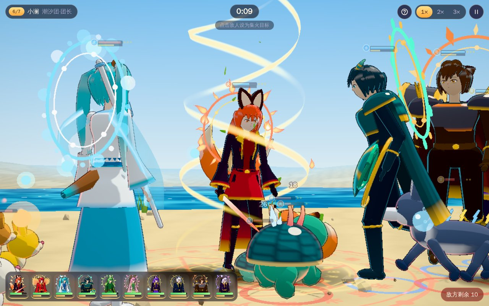
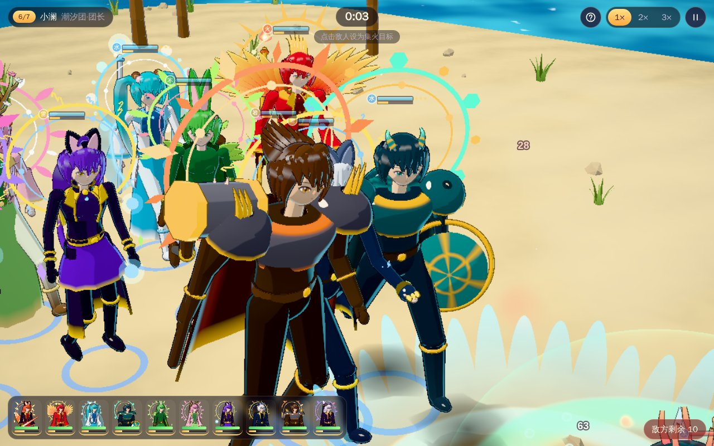
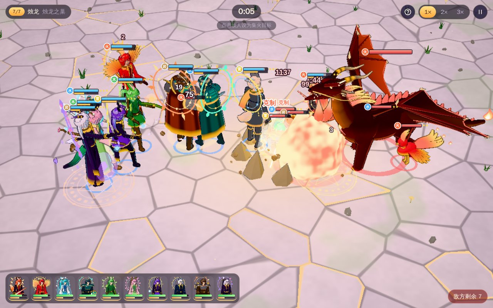
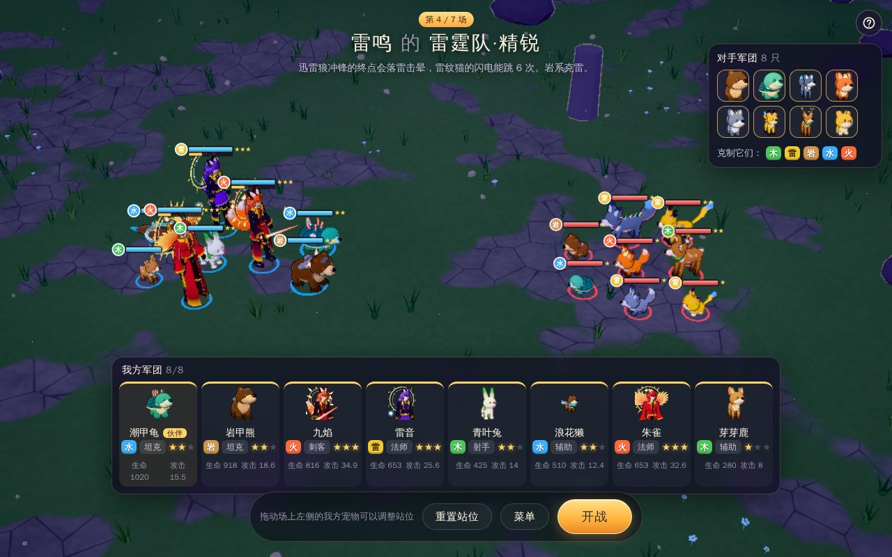
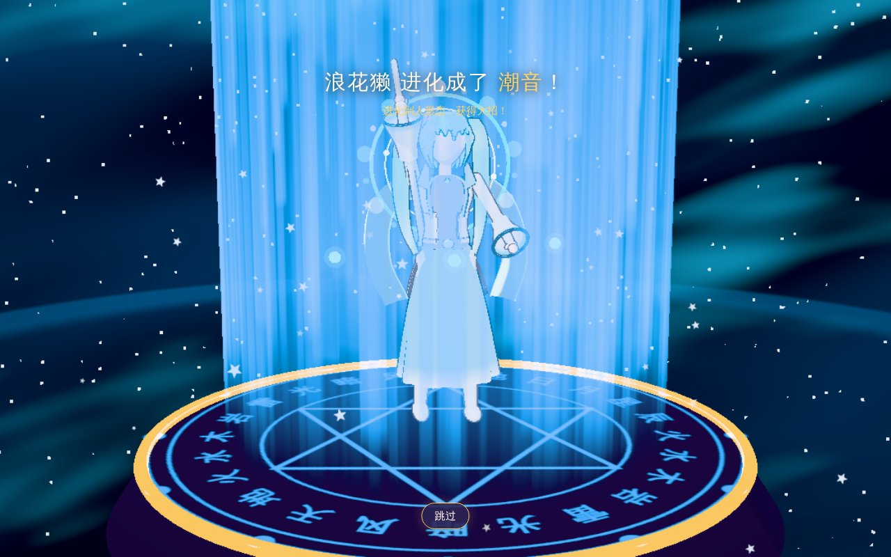
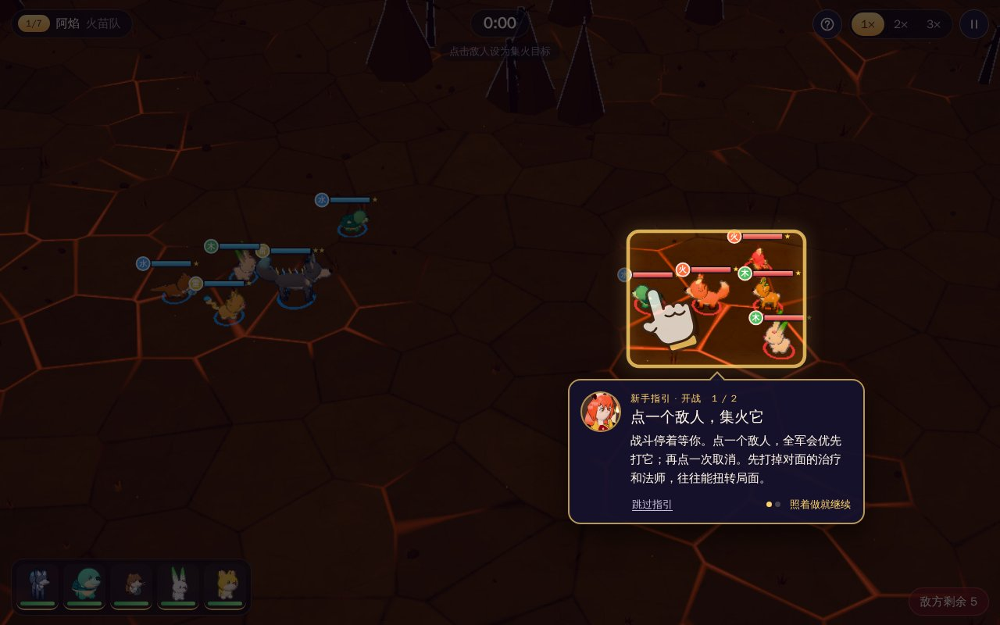
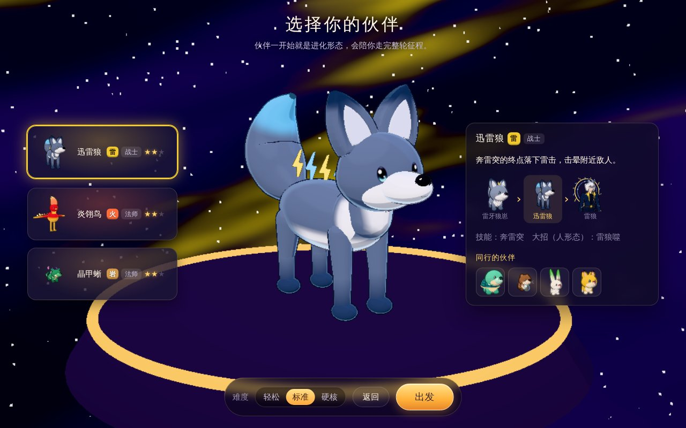
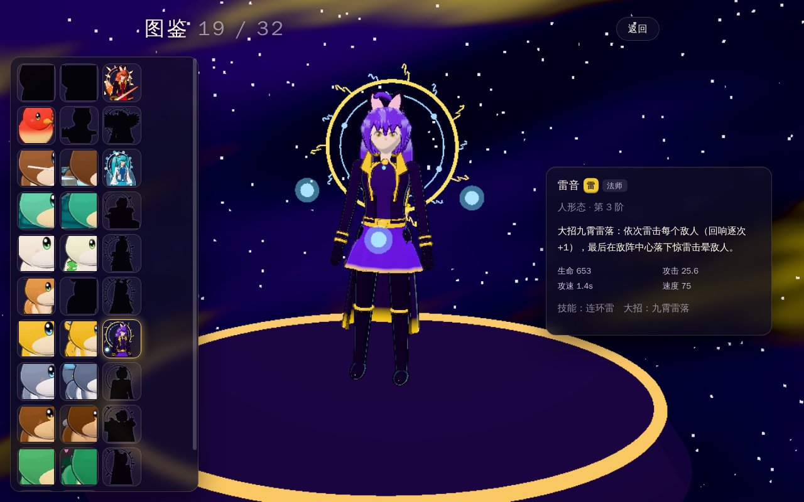

# 回声竞技场

带着一支宠物军团，一路打到烛龙的巢穴。十种宠物分属水、火、木、岩、雷五系，每种三个形态：幼年、进化形态，以及修长帅气的人形态。战斗全自动，宠物自己走位、自己出招，双方在开阔的野外交错换位、切来切去；你只需要在关键时刻点一个敌人让全军集火，或者暂停、加速。

赢了就收服新宠物、让宠物进化，军团从 5 只慢慢扩到 10 只。被击飞的宠物撞上别的单位或场地边缘的结界会打出**回响**，一串连锁越长伤害越高。进化到人形态会获得大招，放大招时镜头会给一段特写。

| 大招特写：人形态放大招，镜头绕到正面仰拍蓄力         | 放技能时镜头推近，其余单位挡住视线时暂时隐去    |
| ---------------------------------------------------- | ----------------------------------------------- |
|                 |          |
| **最后一场：烛龙的巢穴，十只人形态对首领**           | **战前准备：看对手的属性，拖动宠物摆站位**      |
|                  |           |
| **赢了收服与进化各选一个**                           | **进化演出：光柱里换成新形态**                  |
|            |         |
| **新手指引：手指演示，照着拖一下摆站位**             | **新手指引：战斗停着等你点一个敌人集火**        |
|  |  |
| **选一只伙伴开始征程**                               | **图鉴：见过的形态都记在这里**                  |
|               |              |

## 开始玩

### 下载安装包（推荐）

到仓库的 [Releases](https://github.com/XZL-CODE/echo-arena/releases) 下载（每次推送代码后，[Actions](https://github.com/XZL-CODE/echo-arena/actions) 里的“构建与打包”也会产出同样的安装包，登录 GitHub 后可下载）：

| 系统                             | 文件                                 | 说明                                           |
| -------------------------------- | ------------------------------------ | ---------------------------------------------- |
| macOS（Apple 芯片与 Intel 通用） | `EchoArena-<版本>-mac-universal.dmg` | 打开后把 EchoArena（回声竞技场）拖进“应用程序” |
| Windows 10/11（64 位）           | `EchoArena-<版本>-win-setup.exe`     | 安装版，可选安装位置，建桌面快捷方式           |
| Windows 10/11（64 位）           | `EchoArena-<版本>-win-portable.exe`  | 免安装，双击即玩                               |

安装包没有做苹果公证和微软签名，第一次打开会被系统拦一下：

- **macOS**：提示无法验证开发者时，打开“系统设置 → 隐私与安全性”，在页面下方点“仍要打开”。如果提示“已损坏”，在终端执行 `xattr -dr com.apple.quarantine /Applications/EchoArena.app` 后再打开。
- **Windows**：出现“Windows 已保护你的电脑”时，点“更多信息 → 仍要运行”。

画面是实时渲染的 3D，有独立显卡或较新的集成显卡会比较流畅；电脑带不动时会自动降低画质（也可以在设置里手动选）。

### 从源码运行

需要 [Node.js](https://nodejs.org) 22.12 或更新版本。

- macOS：双击 `启动游戏-macOS.command`（若被系统拦截，处理方式同上；若提示没有权限，先执行 `chmod +x 启动游戏-macOS.command`）。
- Windows：双击 `启动游戏-Windows.cmd`。
- 或者在项目目录执行 `npm start`。

第一次运行会自动安装依赖、下载 Electron（约 100 MB，需要联网；官方源下载失败时自动改用 npmmirror 镜像）并构建，之后可以离线游玩。

## 操作

所有操作都能用触控板点击完成，键盘快捷键是补充：

| 操作        | 方式                                                                                     |
| ----------- | ---------------------------------------------------------------------------------------- |
| 摆站位      | 战前在场上按住我方宠物拖到别处（只能摆在左侧我方区域）                                   |
| 开战 / 确认 | 按钮，或 `Enter`                                                                         |
| 集火        | 战斗中点一个敌人，全军优先打它；再点一次取消                                             |
| 暂停 / 继续 | `空格`；右上角的暂停按钮打开暂停菜单（设置、回到战前）                                   |
| 战斗速度    | 右上角 1× / 2× / 3×，或按 `1` `2` `3`                                                    |
| 菜单        | `Esc`（战前是菜单，战斗中是暂停菜单）                                                    |
| 新手指引    | 各界面右上角的“？”重看当前界面（战斗中打开会自动暂停）；标题页的“新手指引”进教学战从头练 |

## 新手指引

新安装后在真实界面上边玩边教。每一步压暗其余界面、只亮出要看或要操作的地方，手指动画演示点哪里、往哪拖，照着做了才进入下一步（讲战斗时战斗停着等你）。各课在对应情形第一次出现时教：

- 第一次战前准备：看对手的宠物和属性 → 认识自己的军团 → 拖动一只宠物摆站位 → 点“开战”。
- 第一次开战：点一个敌人集火 → 暂停与加速在哪里。
- 第一次打出 2 级以上的回响：停在那一刻，圈出发生的位置，讲回响怎么叠。
- 我方第一次放大招：人形态的能量条攒满自动放大招。
- 第一场结算：这一场的关键数据；输了可以回到战前调整。
- 第一次挑奖励：点一张收服、点一张进化，再点“确认”。

“跳过指引”或 `Esc` 一次跳过全部课程，之后不再自动出现。想再看：点各界面右上角的“？”重看当前界面的课（每一步都能直接翻，不要求照做）；标题页的“新手指引”进一场教学战（伙伴是人形态，大招也会教到），从头到尾练一遍，打完回到标题或开始正式一轮，不影响存档里的这一轮。

## 玩法

- **一轮 7 场**：前 6 场的对手按难度档位抽取，每一场都有自己的主题属性和阵容；第 7 场是烛龙，打掉一半血后变身成人形的烛龙君。可上场的宠物数随场次从 5 只增加到 10 只。
- **开局选伙伴**：三只候选里选一只作为伙伴，一开始就是进化形态；另有 4 只幼年同伴，坦克、辅助、输出各有分工。
- **五系相克**：水克火、火克木、木克岩、岩克雷、雷克水。克制时伤害多三成，被克制时少一些。战前能看到对手有哪些宠物、什么属性，以及哪几系克制它们。
- **全自动战斗**：宠物按定位自己走位——坦克顶在前面护着后排，刺客扑向残血的目标，射手和法师隔着距离输出，辅助给受伤的队友回血、加护盾；双方会侧移、后撤、交错换位，不会站成两排对砍。每只宠物有自己的技能，冷却好了自动放。
- **你来决定的**：军团里带谁、站位怎么摆、战斗中集火谁。先打掉对面的治疗和法师，往往能扭转局面。
- **回响**：击飞的单位撞上别的单位或场地边缘的结界、弹丸被反弹，都会让回响 +1，同一串连锁每一环伤害 +25%，最高 8 级。
- **人形态与大招**：进化到第三阶变成人形态，获得大招；能量条攒满自动放出。
- **赢了收服与进化**：每场胜利后，从候选里收服一只新宠物（军团满了就没有），同时让一只宠物进化，两项都生效，也可以不选。
- **输了不丢进度**：可以原样再打，也可以回到战前换站位再来。
- **加时**：60 秒后进入加时，双方伤害逐步提高；3 分钟还分不出胜负算输。
- **图鉴**：见过或拥有过的形态都会记下来，可以随时翻看造型和技能说明。
- 设置里可选难度（轻松 / 标准 / 硬核），只影响新开的一轮。

十种宠物（幼年 / 进化形态 / 人形态）：

| 属性 | 宠物                                                             |
| ---- | ---------------------------------------------------------------- |
| 火   | 小焰狐 / 焰尾狐 / 九焰（刺客）　火团雀 / 炎翎鸟 / 朱雀（法师）   |
| 水   | 泡泡獭 / 浪花獭 / 潮音（辅助）　盾盾龟 / 潮甲龟 / 玄武（坦克）   |
| 木   | 叶耳兔 / 青叶兔 / 森语（射手）　芽芽鹿 / 花角鹿 / 花神（辅助）   |
| 雷   | 电团猫 / 雷纹猫 / 雷音（法师）　雷牙狼崽 / 迅雷狼 / 雷狼（战士） |
| 岩   | 石头熊 / 岩甲熊 / 岩王（坦克）　晶晶蜥 / 晶甲蜥 / 晶龙（法师）   |

## 画面

- **全部用代码生成的 3D**：宠物、人形态、烛龙和战场都是程序里一块块搭出来的模型，没有图片或模型文件。卡通着色加描边；人形态约六头身，带角、光环、披风和金饰；动作有待机、奔跑、侧移、后撤、出招、放大招、受击、倒下和胜利。
- **开阔的战场**：六种野外场景（草原、火山、潟湖、雷暴高地、峡谷、云上遗迹），地形一直延伸到地平线，地面有草丛、碎石和水面；场地边缘有看不见的结界，被撞上时才亮起。
- **立体特效**：刀光是弯曲的光刃，火球会翻滚、溶解，冲击波是一圈立体的光壳，漩涡、雷球、水花、落石都有体积，碎石和叶片会按物理飞散、落地。
- **镜头**：平时自动框住交战区域，慢慢漂移；放技能时推到施放者身边，大招分两段——先绕到正面仰拍蓄力，再切到侧面看出手命中。挡在镜头前的单位会暂时隐去。特写有间隔，不会一个接一个把战斗拖慢；设置里可以关掉“技能与大招特写”。
- **看得清优先**：血条按敌我分色（我方天青、对手珊瑚），并标出属性和星级；特写时血条和数字退到后面；同一处一瞬间只闪一次。
- **设置 → 画面**：可以关掉震屏和伤害数字；打开“减少闪烁”会去掉闪白、减弱光效；画质可选自动 / 高 / 中 / 低，自动时按实际帧率调整。

## 存档与重置

存档和设置只保存在这台电脑上，不需要账号，不联网：

- macOS：`~/Library/Application Support/EchoArena/save.json`
- Windows：`%APPDATA%\EchoArena\save.json`

同目录的 `save.backup.json` 是上一次写入前的备份。设置里有“打开存档文件夹”按钮。

保存的内容：当前一轮的场次、军团（每只宠物的形态与站位）、待选的奖励、设置、图鉴、新手指引学过哪几课和通关记录（教学战不写进存档）。战前准备的改动随时保存，开战、选奖励、结算时也会保存；**战斗进行到一半不保存**，关掉后再打开会回到这一场的战前准备，军团和站位都在，标题页会说明从哪里继续。

从 v0.4.0 及更早版本升级：旧版是另一套玩法，进行中的一轮无法沿用，读入时丢弃（会提示一次）；设置和通关记录保留，新手指引会重新教一遍。

重置：设置 → “清除全部存档”（会先确认，原存档改名为 `save.backup.json` 保留一次），之后就像刚安装一样，新手指引也会重新出现。也可以在游戏关闭时直接删除上面的 `EchoArena` 文件夹。

## 开发

| 命令                                   | 作用                                          |
| -------------------------------------- | --------------------------------------------- |
| `npm run dev`                          | 监听源码，改动后自动重新构建并刷新窗口        |
| `npm test`                             | 规则单元测试                                  |
| `npm run test:e2e`                     | 构建后跑客户端端到端测试                      |
| `npm run typecheck` / `npm run format` | 类型检查 / 格式化                             |
| `npm run balance`                      | 自动对战数值报告                              |
| `npm run shots`                        | 重新生成 README 截图（Linux 上用 `xvfb-run`） |
| `npm run dist:mac` / `dist:win`        | 在对应系统上打包，输出到 `release/`           |

代码结构：`src/core` 是不依赖界面的规则与内容（宠物与形态、技能与大招、五系相克、走位、回响、一轮流程、存档格式）；`src/gfx` 用 three.js 画 3D（`kit` 建模工具、`models` 各形态造型、`anim` 程序动画、`battle` 战场与镜头、`fx` 特效）；`src/audio` 合成声音，`src/game` 连接规则与画面，`src/ui` 是界面与新手指引；`src/lab` 是开发用的造型样张页（`scripts/lab-shot.mjs` 截图）；`electron/` 是客户端外壳（窗口、本地资源协议、存档读写）。代码合并到 `main` 后，CI 在测试通过后把安装包发布到 Releases，版本号取 `package.json` 的 `version`（这个版本已发布过就跳过，发新版先改版本号）；推送 `v*` 标签，或在 Actions 里手动运行“构建与打包”并填写版本号，也会发布。
